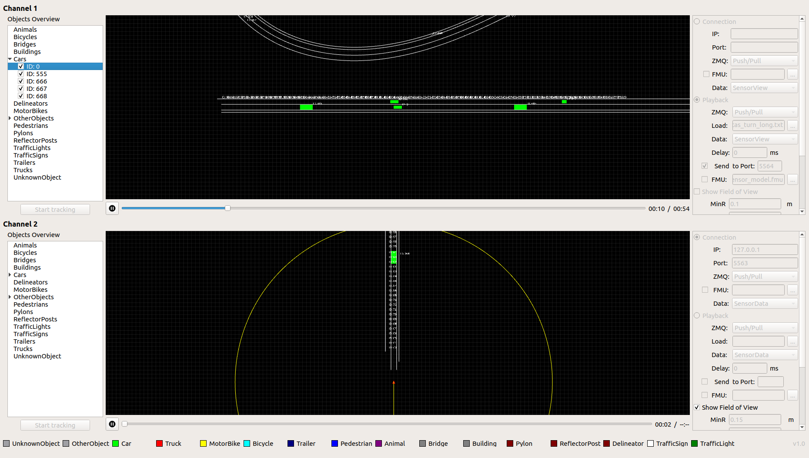

# OSI Visualizer
[](https://travis-ci.org/OpenSimulationInterface/osi-visualizer)

OSI Visualizer serves as a visualization tool for the current implementation of [OSI (Open Simulation Interface)](https://github.com/OpenSimulationInterface/open-simulation-interface) messages. It supports `GroundTruth`, `SensorView` and `SensorData` messages and allows the visualization of two independent data channels using different input types (file and network stream). For more information see the documentation [here](https://opensimulationinterface.github.io/osi-documentation/osi-visualizer/README.html).

## Usage

Use the configuration panel at the right (see Screenshot below) to load e.g. a playback file for channel 1 at `Playback` and choose a port to which it will be send (here 5564). Select the data type `SensorView` according to the content of the file. After that enter into the IP field the `localhost` and into the port field the receiving port (here 5563) for channel 2 in the panel below at `Connection`. Select the data type it is expected to visualize (here `SensorData`). In this example an intermediary on localhost processes the data from the input file using a [OSMP](https://github.com/OpenSimulationInterface/osi-sensor-model-packaging) sensor model, transforms it into `SensorData` and sends it to port 5563.


Now you can click on play for channel 1 and 2 and you can visualize the communication between these two channels. Channel 1 plays the selected OSI input file scenario and sends out the OSI message to port 5564 at the same time. Channel 2 visualizes the received OSI messages at `localhost` at port 5563 showing it on the canvas (see demo screenshot below).



## Installation

#### Environment and dependencies

Currently we recommend users to use the osi-visualizer under Ubuntu Linux 18.04 LTS. You can see a working development environment based on Ubuntu 18.04 LTS in the Docker file in the repository.

* [cmake](https://cmake.org/) (>= 3.5) 
* [Qt](http://download.qt.io/official_releases/qt/) (>= 5.5.0)
* [ZeroMQ](http://zeromq.org/intro:get-the-software) (>= 4.2.1) OSI Visualizer needs to use ZeroMQ libraries to complete the socket communication between different sensor / traffic / scenario simulators. Note that the C++ Bindings are required as well.
* [protobuf](https://github.com/google/protobuf) (>= 2.6.1)
* [FMILibrary](https://svn.jmodelica.org/FMILibrary/tags) (>= 2.0.2)
* [OSI](https://github.com/OpenSimulationInterface/open-simulation-interface.git) (>= 3.1.2) 

You can install package dependencies using the provided `install-deps.sh`, and OSI and FMILibrary build dependencies using the provided `build-install-build-deps.sh`:

```bash
$ sudo bash install-deps.sh
$ sudo bash build-install-build-deps.sh
```

It is often a good idea to first update the system using

```bash
$ sudo apt-get update && sudo apt-get upgrade && sudo apt-get autoremove
```

to ensure up-to-date packages.

#### Build and run
```bash
$ bash build.sh
$ ./build/osi-visualizer
```

or just manually if dependecies are already installed:

```bash
$ git clone https://github.com/OpenSimulationInterface/osi-visualizer.git
$ cd osi-visualizer
$ git submodule update --init
$ mkdir build
$ cd build
$ cmake ..
$ make -j8
$ ./osi-visualizer
```
